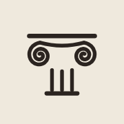

<p align="center">
  
</p>

<h1 align="center">Olimpia for agents</h1>

<p align="center">
  The official skill and plugin to deploy and operate <a href="https://olimpia.dev">Olimpia</a> from Claude Code, Codex, Cursor and any agent that speaks MCP.
</p>

---

[Olimpia](https://olimpia.dev) is a cloud platform from Buenos Aires: app hosting, managed Postgres and Redis, and S3-compatible buckets, grouped in projects. This repository gives your agent two things:

- **The Olimpia MCP server** (`https://api.olimpia.dev/mcp`): tools to create apps, upload and deploy code, set env vars, create and connect databases, run SQL, add domains and read logs. It signs in with OAuth the first time.
- **The `olimpia` skill**: the workflows and the details agents get wrong otherwise, like binding to `$PORT`, uploading a folder, connecting a database and fixing failed builds.

## Install

**Claude Code** (plugin: skill and MCP server together)

```
/plugin marketplace add olimpiacloud/olimpia-skills
/plugin install olimpia@olimpia
```

Then run `/mcp` and sign in to Olimpia.

**Any agent with skills support** (Claude Code, Codex, Cursor, OpenCode, Gemini CLI and others)

```bash
bunx skills add olimpiacloud/olimpia-skills
```

and add the MCP server to your client:

| Client | Command or config |
| --- | --- |
| Claude Code | `claude mcp add --transport http olimpia https://api.olimpia.dev/mcp` |
| Codex | `codex mcp add olimpia --url https://api.olimpia.dev/mcp` |
| Cursor, VS Code, Windsurf | `{"mcpServers": {"olimpia": {"url": "https://api.olimpia.dev/mcp"}}}` |
| claude.ai, ChatGPT | Add a custom connector with the URL `https://api.olimpia.dev/mcp` |

**Remote machines** (a VPS over SSH, containers): run `claude mcp login olimpia --no-browser`, open the URL on your computer, authorize, and paste the connection code Olimpia shows back into the terminal.

**CI and scripts**: create a personal token in Account → Agents & tokens and send it as `Authorization: Bearer`. See [skills/olimpia/references/api.md](skills/olimpia/references/api.md).

## Try it

> Deploy this folder to Olimpia with a Postgres database.

> The last deploy of `web` failed, find out why and fix it.

> Point app.mycompany.com to the `web` app.

## What's inside

```
.claude-plugin/        plugin and marketplace manifests
.mcp.json              the remote Olimpia MCP server
skills/olimpia/
  SKILL.md             resource model, tools by intent, workflows and rules
  references/
    deploy.md          preparing apps per stack, monorepos, Dockerfiles, uploads
    data.md            Postgres, Redis and buckets: connecting, ORMs, SQL, public access
    troubleshooting.md failed deployments and apps that don't respond
    api.md             personal tokens, REST API, GitHub Actions
```

## Safety

The agent acts with your account's permissions. Delete tools require the exact resource name as confirmation, secrets are hidden unless explicitly requested, and you can revoke any connected agent from Account → Agents & tokens.

## Links

- Website: https://olimpia.dev
- For LLMs: https://olimpia.dev/llms.txt
- Contact: hola@olimpia.dev

## License

MIT
